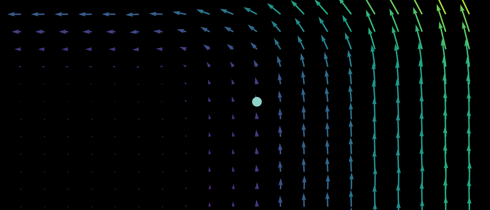

 <head>

  <!-- Global site tag (gtag.js) - Google Analytics -->
  
 <!--
 
 
 -->

 <meta name="Description" CONTENT="Author: Benjamin Badger, Category: Informational">
 <meta name="google-site-verification" content="UtBQXaaKqY6KYEk1SldtSO5XVEy9SmoUfqJ5as0603Y" />
 </head>

## Dynamics
The mathematical approach to change over time. Most dynamical systems are nonlinear and generally unsolvable, and though deterministic are often unpredictable.  

### [Logistic map](/logistic-map.md)

### [Clifford attractor](/clifford-attractor.md)

### [Grid map](/grid-map.md)

### [Pendulum phase space](/pendulum-map.md)

## Boundaries 
Trajectories of any dynamical equation may stay bounded or else diverge towards infinity.  The borders between bounded and unbounded trajectories can take on spectacular fractal geometries.  

### [Polynomial roots I](/polynomial-roots.md)

### [Polynomial roots II](/polynomial-roots2.md)

### [Julia sets](/julia-sets.md)

### [Mandelbrot set](/mandelbrot-set.md)

### [Henon map](/henon-map.md)

### [Clifford map](/clifford-boundary.md)

### [Logistic map](/logistic-boundary.md)

## Foundations

### [Primes are unpredictable](/unpredictable-primes.md) 

$$
\lnot \exists n, m : (g_n, g_{n+1}, g_{n+2}, ... , g_{n + m - 1}) \\
= (g_{n+m}, g_{n+m+1}, g_{n+m+2}, ..., g_{n + 2m - 1}) \\
= (g_{n+2m}, g_{n+2m+1}, g_{n+2m+2}, ..., g_{n + 3m - 1}) \\
\; \; \vdots
$$

### [Aperiodicity implies sensitivity to initial conditions](/chaotic-sensitivity.md)

$$
f(x) : f^n(x(0)) \neq f^{n+k}(x(0)) \forall k \implies \\
\forall x_1, x_2 : \lvert x_1 - x_2 \rvert < \epsilon, \; \\
\exists n \; : \lvert f^n(x_1) - f^n(x_2) \rvert > \epsilon
$$

### [Aperiodic maps, irrational numbers, and solvable problems](/aperiodic-irrationals.md)

$$  
\Bbb R - \Bbb Q \sim \{f(x) : f^n(x(0)) \neq f^k(x(0))\} \\
\text{given} \; n, k \in \Bbb N \; \text{and} \; k \neq n \\
$$

### [Irrational numbers on the real line](/irrational-dimension.md)

$$
\Bbb R \neq \{ ... x \in \Bbb Q, \; y \in \Bbb I, \; z \in \Bbb Q ... \}
$$

### [Discontinuous aperiodic maps](/most-discontinuous.md)

$$
\{ f_{continuous} \} \sim \Bbb R \\
\{ f \} \sim 2^{\Bbb R}
$$

### [Poincaré-Bendixson and dimension](/continuity-poincare.md)

$$
D=2 \implies \\
\forall f\in \{f_c\} \; \exists n, k: f^n(x) = f^k(x) \; if \; n \neq k
$$

### [Computability and Periodicity I: the Church-Turing thesis](/solvable-periodicity.md)

$$
\\
\{i_0 \to O_0, i_1 \to O_1, i_2 \to O_2 ...\}
$$

### [Computability and Periodicity II](/uncomputable-aperiodics.md)

$$
x_{n+1} = 4x_n(1-x_n) \implies \\
x_n = \sin^2(\pi 2^n \theta) 
$$

### [Nonlinearity and dimension](/nonlinear-dimension.md)

### [Reversibility and periodicity](/aperiodic-inverted.md)

$$
x_{n+1} = rx_n(1-x_n) \\
\; \\
x_{n} = \frac{r \pm \sqrt{r^2-4rx_{n+1}}}{2r}
$$

### [Additive transformations](/additivity-order.md)

### [Fractal Geometry](/fractal-geometry.md)

## Physics
As for any natural science, an attempt to explain observations and predict future ones using hypothetical statements called theories.  Unlike the case for axiomatic mathematics, such theories are never proven because some future observation may be more accurately accounted for by a different theory.  As many different theories can accurately describe or predict any given set of observations, it is customary to favor the simplest as a result of Occam's razor.  

### [Three Body Problem](/3-body-problem.md)

### [Entropy](/entropy.md)

### [Quantum Mechanics](/quantum-mechanics.md)

$$
P_{12} \neq P_1 + P_2 \\
P_{12} = P_1 + P_2 + 2\sqrt{P_1P_2}cos \delta
$$

## Biology
The study of life, observations of which display many of the features of nonlinear mathematical systems: an attractive state resistant to perturbation, lack of exact repeats, and simple instructions giving rise to intricate shapes and movements.  

### [Genetic Information Problem](/genetic-info-problem.md)

### [Homeostasis](/homeostasis.md)

## Deep Learning

Machine learning with layered representations.  Originally inspired by efforts to model the animalian nervous system, much work today is of somewhat dubious biological relevance but is extraordinarily potent for a wide range of applications.  For some of these pages and more as academic papers, see [here](https://arxiv.org/search/?searchtype=author&query=Badger%2C+B+L).

### [Image Classification](/neural-networks.md) 

### [Input Attribution and Adversarial Examples](/input-adversarials.md)

### [Input Generation I: Classifiers](/input-generation.md)

### [Input Generation II: Vectorization and Latent Space Embedding](/latent_output.md)

### [Input Generation III: Input Representations](/input-representation.md)

### [Input Representation I: Depth and Representation Accuracy](/depth-generality.md)

### [Input Representation II: Vision Transformers](/vision-transformers.md)

### [Language Representation I: Spatial Information](/language-representations.md)

### [Language Representation II: Sense and Nonsense](/language-representations-inputs.md)

$$
\mathtt{This \; is \; a \; prompt \; sentence} \\ 
\mathtt{channelAvailability \; is \; a \; prompt \; sentence} \\ 
\mathtt{channelAvailability \; millenn \; a \; prompt \; sentence} \\
\dots \\
\mathtt{redessenal \; millenn-+-+DragonMagazine}
$$

### [Language Representation III: Noisy Communication on a Discrete Channel](/language-discreteness.md)

$$
a = \mathtt{The \; sky \; is \; blue.} \\ 
a_g = \mathtt{The \; sky \; is \; blue \lt s \gt}
$$

<html>
<body>

The wipers on the bus go swish swish
 
   
 Predicted next token:  sw
  
</body>
</html>

### [Feature Visualization I](/feature-visualization.md)

### [Feature Visualization II: Deep Dream](/deep-dream.md)

### [Feature Visualization III: Transformers and Mixers](/transformer-features.md)

### [Autoencoders](/autoencoder-representation.md)

### [Diffusion Inversion](/diffusion-inversion.md)

### [Generative Adversarial Networks](/generative-adversarials.md)

### [Normalization and Gradient Stability](/gradient-landscapes.md)

### [Small Language Models for Abstract Sequences](/neural-networks3.md)

### [Interpreting Sequence Models](/nn_interpretations.md)

### [Training Memory](/neural-networks2.md)

### [Limitations of Neural Networks](/nn-limitations.md)

## Small Projects

### [Game puzzles](/puzzle-projects.md)

### [Programs to compute things](/computing-programs.md)

$$
\; \\
\begin{vmatrix}
a_{00} & a_{01} & a_{02} & \cdots & a_{0n} \\
a_{10} & a_{11} & a_{12} & \cdots & a_{1n} \\
\vdots & \vdots & \vdots & \ddots & \vdots \\
a_{n0} & a_{n1} & a_{n2} & \cdots & a_{nn} \\
\end{vmatrix}
\; \\
$$

$$ 
\; \\
5!_{10} = 12\mathbf{0} \to 1 \\
20!_{10} = 243290200817664\mathbf{0000} \to 4 \\
n!_k \to ?
\; \\
$$
 	
## High voltage 
High voltage engineering projects: follow the links for more on arcs and plasma.

### [Tesla coil](/tesla-coils.md)

### [Fusor](/fusor.md)

### [About The Author](/about-me.md)

